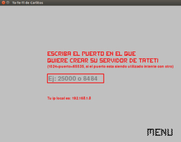
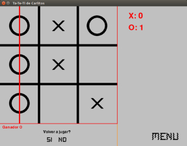

# TaTeTi
Juego de TaTeTi en RED

Descripción: tateti con interfaz gráfica y menu de selección para jugar contra una computadora, dos jugadores en la misma pc, o dos jugadores a travez de una comunicación de tipo cliente/servidor-servent. Si se conoce la ip pública del servidor y éste abre el puerto que va a usar desde el modem(tcp) también se puede jugar a travez de internet. Se puede jugar en windows y linux, pero por ahora la parte de red solo para linux (debido al uso de threads para poder crear/unirse en una sola ventana, pero lo he probado sin el menu y funciona en ambos so). 

Es necesario tener instalado los siguientes paquetes de python:

        -pygame >= v1.9.4 : para la interfaz gráfica
        -twisted >= v16.0.0 : framework de red 

Posibles mejoras:

        -refactorización del código
        -no utilizar threads y bombear el reactor de twisted
        
        
        
Si se tiene problemas para instalar twisted en windows descargarlo aquí https://www.lfd.uci.edu/~gohlke/pythonlibs/#twisted e instalar con pip, 'pip install *.whl', también encontrará los wheels de pygame en el link si los desea.

  

